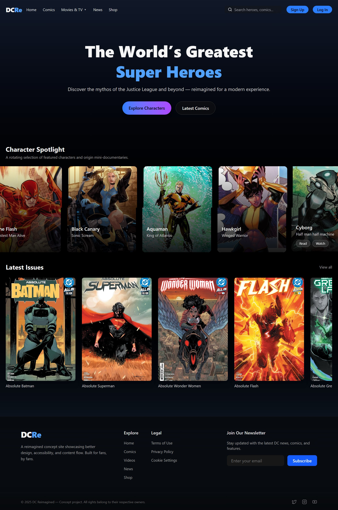
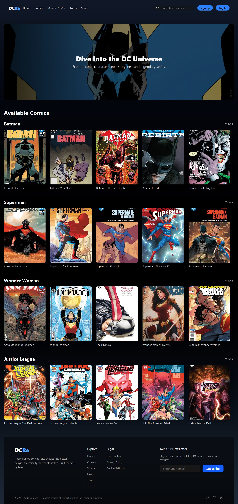

# 🌌 DC Reimagined

A modern reimagined DC Universe fan website built with **React** and **Tailwind CSS**.  
It showcases DC Comics, Movies & TV, News, and Characters in an interactive and visually appealing way.  
This project is for learning and practice purposes only — not an official DC website.

---

## 📸 Screenshots

### Homepage

### Movies Page

---

## ⚙️ Features

- 🎨 **Modern UI** inspired by [dc.com](https://www.dc.com)  
- 🎥 **Featured video player** with in-site playback  
- 📚 **Comics & Characters carousel** with smooth animations  
- 📰 **News section** styled like official DC site  
- 🔐 **Sign Up / Log In pages** with social login buttons  
- 📩 **Newsletter subscription** in the footer  
- 🖱 **Hover animations & dropdown menus** for better navigation  

---

## 🛠 Tech Stack

- **React** – component-based frontend  
- **Tailwind CSS** – utility-first styling  
- **Framer Motion** – animations & transitions  
- **Lucide React / React Icons** – iconography  
- **React Router DOM** – page routing  

